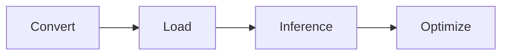

## Before you start
ITREX LLM C++ Runtime (`Neural Speed`) has already supported some popular models like `LLAMA`,`GPT-J`, `GPT-NEOX`, `DOLLY`, etc.These LLMs have similar architectures and some of them share the same architect (`DOLLY` and `GPT-NEOX`). Before adding a new model, you can checkout its architecture (from Huggingface `config.json`) whether is in our [supported list](./neural_speed/models/model_utils/model_types.h#L68).

However, LLM inference thing is complicated. It may have its own: 1. special tokenizer (or vocab); 2. architecture (or forward pipeline); 3. operators (or kernels). Generally speaking, the first and second points appear frequently for transformers-LLMs. I will show you how to run a new model as soon as possible when your model hasn't any problems like above or only the problem 1. The next sections will discuss about the problem 2 and the problem 3 is beyond the scope of this document.

For simplicity, we take [polyglot](https://huggingface.co/EleutherAI/polyglot-ko-5.8b) as the example model. It has the same architecture as `GPT-NEOX` but only fewer layers.

Firstly, we need to add its temp buffer in its [related model-arch header file](neural_speed/models/gptneox/gptneox.h) and [re-compile](README.md#Install).
```diff
static const model_scratch gptneox_mem_req(int n_layers, float scratch_size_ratio = 1.0f) {
  switch (n_layers) {
    case 44:
      return {2048ull * MB, 2048ull * MB, 4096ull * MB};
    case 32:
      return {512ull * MB, 512ull * MB, 1026ull * MB};
+   case 28:  // 5.8B
+     return {512ull * MB, 512ull * MB, 1024ull * MB};
    default:
      MODEL_ASSERT(false);
  }
}
```

Then, use `transformers` tokenizer to encode prompt and decode return tokens instead of re-implementing C++ tokenizer.

For checking text generation results, we recommend you to run this python codes below to align our runtime engine outputs with PyTorch (`FP32 data type, greedy search`).
```python
from transformers import AutoTokenizer, TextStreamer
from intel_extension_for_transformers.transformers import AutoModelForCausalLM, WeightOnlyQuantConfig
from neural_speed import Model

model_name = "EleutherAI/polyglot-ko-5.8b"
prompt = "she open the door and see"
tokenizer = AutoTokenizer.from_pretrained(model_name, trust_remote_code=True)
inputs = tokenizer(prompt, return_tensors="pt").input_ids

# pt infer
pt_model = AutoModelForCausalLM.from_pretrained(model_name, trust_remote_code=True)
pt_model.eval()
pt_outputs = pt_model.generate(inputs, do_sample=False, max_new_tokens=128)
pt_ans = tokenizer.batch_decode(pt_outputs, skip_special_tokens=True, clean_up_tokenization_spaces=False)[0]
print("=====pytorch result======")
print(pt_ans)

# itrex infer
# fp32 config
woq_config = WeightOnlyQuantConfig(not_quant=True)
# model file should be in `runtime_outs` folder
model = AutoModelForCausalLM.from_pretrained(model_name, quantization_config=woq_config, trust_remote_code=True)
outputs = model.generate(inputs, do_sample=False, max_new_tokens=128)
ans = tokenizer.batch_decode(outputs, skip_special_tokens=True, clean_up_tokenization_spaces=False)[0]
print("=====itrex result======")
print(ans)
```

The English prompt would have the output like:
```bash
=====pytorch result======
she open the door and see him. She looks at him and says, "How do you do?" He says, "Fine." She says, "What do you want?" He says, "I want to go home." She says, "Where are you going?" He says, "I'm going home." She says, "Where are you going?" He says, "I'm

=====itrex result======
she open the door and see him. She looks at him and says, "How do you do?" He says, "Fine." She says, "What do you want?" He says, "I want to go home." She says, "Where are you going?" He says, "I'm going home." She says, "Where are you going?" He says, "I'm
```

Once you make sure your model has the same generated tokens as PyTorch, you can deploy it by using low-bits precision like `INT4` data type and customized acceleration. Please refer to `Python API` section for more details.

# Enable cpp model process
We enable a CPP model in the following four steps.



# 1.	Model conversion

We need to implement corresponding serialization methods from pytorch format, which is mainly divided into the following three steps.

## 1.1.	Hyperparamters
The term **"hyperparamters"** describes a value that is used to configure the behavior of a large language model; this is in contrast to the model's parameters, which are the weight that were derived in the training process that was used to create the model. Each model defines its own hyperparameter structure that defines the hyperparameter values accepted by that model. Valid ITREX model files must list these values in the correct order, and each value must be represented using the correct data type. Although hyperparameters are different across models, some attributes appear in the hyperparameters for most models:
- n_vocab: the size of the model's vocabulary
- n_embd: the size of the model's " embedding layer", which is used during prompt ingestion.
- n_layer: the number of layers in the model; each layer represents a set of weights.
Here we will use [convert_gptneox.py](neural_speed/convert/convert_gptneox.py#L96) as an example,
```python
fout.write(struct.pack("i", hparams["num_attention_heads"]))
fout.write(struct.pack("i", hparams.get("n_head_kv", 0)))  # multi-query attention
fout.write(struct.pack("i", hparams["num_hidden_layers"]))
```
The above `fout` is the file we need to get, and the `num_attention`, `n_head_kv`, and `num_hidden_layer` from hparams is written into fout.

## 1.2.	Vocabulary
As the name implies, a model's vocabulary comprises components that are used by the model to generate language (text). However, unlike the vocabulary of a human, which consists of words, the vocabulary of a large language model consists of "tokens". A token can be an entire word, but oftentimes they are word fragments. Just like humans can compose millions of words from just a dozen or two letters, large language models use tokens to express a large number of words from a relatively smaller number of components. Consider a vocabulary with the following tokens: `whi`, `ch`, `le`, `who`, and `a`; this vocabulary can be used to create the English words `"which"`, `"while"`, `"who"`, `"a"`, and `"leach"`. How would the behavior change if the model contained the following tokens: `wh`, `ich`, `ile`, `o`, and `leach`? Choices such as these allow model-creators to tune the behavior and performance of their models.

As described above, the model's hyperparameters typically contain a value that specifies the number of tokens in the vocabulary. The vocabulary is encoded as a list of tokens, each of which includes a 32-bit integer that specifies the length of the token. If your model has some new tokenizers, we suggest using a python tokenizer from transformers and feeding the input_ids to model Python API (python example in scripts folder)
Here we will use [convert_gptneox.py](neural_speed/convert/convert_gptneox.py#L122) as an example to processed the vocabulary of gptneox and written it into `fout`.
```python
encoder = tokenizer.vocab
encoder.update(tokenizer.get_added_vocab())
byte_encoder = bytes_to_unicode()
byte_decoder = {v:k for k, v in byte_encoder.items()}
```

## 1.3.	Model weights
Finally, and largest, component of a `Neural Speed` GRAPH file is the weights of the LLM that the file represents. Abstractly, a large language model is software that is used to generate language - just like software that is used to generate images can be improved by increasing the number of colors with which images can be rendered, large language models can be improved by increasing the number of weights in the model. The total number of weights in a model is referred to as the "size" of that model. For example, the dolly-v2-3b implementation of the gpt-neox-20b language model architecture is available in several sizes, like 3B and 20B, which stand for 3 billion and 20 billion, respectively. These numbers refer to the total number of weights in that model.

As described in the hyperparameters section, weights are grouped in sets called "layers", which, like hyperparameters, have structures that are uniquely defined by the model architecture; within a layer, weights are grouped in structures called "tensors". So, for instance, both dolly-v2-3B and gpt-neox-20B use layers that comprise the same tensors, but dolly-v2-3B has relatively fewer layers when compared to gpt-neox-20B.
Here we will use [convert_gptneox.py](neural_speed/convert/convert_gptneox.py#L149) as an example to convert model weights to `fout`.
```python
fout.write(struct.pack("iii", n_dims, len(str), ftype_cur))
for i in range(n_dims):
fout.write(struct.pack("i", data.shape[n_dims - 1 - i]))
fout.write(str)
data.tofile(fout)
```

# 2.	Model enablements

## 2.1.	Model loading
- Model type: Refers to the type of the model, This can be compared to the model type in the Transformers library, we can see model_class in [model_type.h](neural_speed/models/model_utils/model_types.h#L68), here defines the basic properties of an neural speed model, including model_hparams, model_layer, model_struct.etc. If you have a new cpp model you should update [model_archs](neural_speed/models/model_utils/model_types.h#L68).
```diff
enum model_archs {
  MODEL_UNKNOWN,
  MODEL_LLAMA,
  MODEL_GPTJ,
  MODEL_MPT,
  MODEL_GPTNEOX,
  MODEL_STARCODER,
  MODEL_FALCON,
  MODEL_OPT,
  MODEL_BLOOM,
  MODEL_BAICHUAN,
  MODEL_CHATGLM2,
  MODEL_CHATGLM,
+ MODEL_NEW
};
```
and update [model_name_to_arch()](neural_speed/models/model_utils/model_types.h#L395).
```diff
 private:
  model_name_to_arch() {}
  // update this table if has new cpp model
  std::unordered_map<std::string, model_archs> name2arch_ = {
      {"unknown", MODEL_UNKNOWN},   {"llama", MODEL_LLAMA},
      {"gptj", MODEL_GPTJ},         {"mpt", MODEL_MPT},
      {"opt", MODEL_OPT},           {"gptneox", MODEL_GPTNEOX},
      {"dolly", MODEL_GPTNEOX},     {"starcoder", MODEL_STARCODER},
      {"falcon", MODEL_FALCON},     {"bloom", MODEL_BLOOM},
      {"chatglm2", MODEL_CHATGLM2}, {"chatglm", MODEL_CHATGLM},
-     {"baichuan", MODEL_BAICHUAN}};
+     {"baichuan", MODEL_BAICHUAN}},{"new_model", MODEL_NEW_MODEL}};
};
```
- Set buffer size: we need to set the corresponding buffer size in model.h according to the size of parameters for the model, just like [gptneox.h](neural_speed/models/gptneox/gptneox.h), you should update [enum gptneox_model](neural_speed/models/gptneox/gptneox.h#L21), [model_scratch](neural_speed/models/gptneox/gptneox.h#L26) and [model class](neural_speed/models/gptneox/gptneox.h#L39).
```diff
+#ifndef NEW_MODEL_H
+#define NEW_MODEL_H

+#include "models/model_utils/model_files.h"
+#include "models/model_utils/model_types.h"

+enum new_model {
+  NEW_MDOEL_UNKNOWN,
+  NEW_MODEL_13B,
+};

+static const model_scratch new_model_mem_req(int n_layers, float scratch_size_ratio = 1.0f) {
+  switch (n_layers) {
+    case N:
+      return {8192ull * MB, 8192ull * MB, 8192ull * MB};
+    default:
+      MODEL_ASSERT(false);
  }
+}

+class NEW_MODEL : public IModel {
+ private:
+  model_archs name = MODEL_NEW_MODEL;
+  std::unique_ptr<model_model_loader> ml;
+  uint32_t n_layer, n_embd, n_ff, n_vocab;
+  int n_ctx, n_gpu_layer;
+  bool use_mmap, use_mlock, vocab_only;
+  model_scratch scratch;

+ public:
+  void init(const char* path_model, model_context& lctx, int n_ctx, int n_gpu_layers, bool use_mmap_, bool use_mlock_,
+            bool vocab_only_) override;
+  void load(model_context& lctx, model_progress_callback progress_callback, void* progress_callback_user_data) override;
+};

+#endif  // NEW_MODEL_H
```
- Model_load_internal: This function include model init and model load, The [model init function](neural_speed/models/gptneox/gptneox_utils.cpp#L42) initializes the model's hyperparameter, such as `n_layer` and `n_embd parameters`.
```cpp
n_embd = hparams.n_embd;
n_vocab = hparams.n_vocab;
n_layer = hparams.n_layer;
```
The weights of the model in the `Neural Speed` Graph file will be loaded in [model load function](neural_speed/models/gptneox/gptneox_utils.cpp#L71). Here, we'll re-read some of the parameters and weights of the converted binary,include ffn, attention, and norm weight and bias, We'll use the mapping between the name and the weight to read the weight we need. It is shown below.
```cpp
model.others[0] = ml->get_tensor("gpt_neox.embed_in.weight", {n_embd, n_vocab}, NE_BACKEND_CPU);
model.others[1] = ml->get_tensor("gpt_neox.final_layer_norm.weight", {n_embd}, NE_BACKEND_CPU);
model.others[2] = ml->get_tensor("gpt_neox.final_layer_norm.bias", {n_embd}, NE_BACKEND_CPU);
model.others[3] = ml->get_tensor("embed_out.weight", {n_embd, n_vocab}, NE_BACKEND_CPU);
```
Here we use get_tensor function to read `gpt_neox_embed_in.weight` with a shape of `(n_vocab,n_embd)` tensor into `model.others[0]`.

So when enabling a new model, we should implement the `new_model_utils.cpp` of the new model.


## 2.2.	Inference process
- Model_eval_internal: This function can be equivalent to the forward process in pytorch, which has the same computational process. In [gptneox.cpp](neural_speed/models/gptneox/gptneox.cpp), the model_eval_internal here will perform a complete operation on the input values, such as ffn, layernorm, mha, etc. Here's a layernorm operation:
```cpp
cur = ne_norm(ctx0, inpL);
cur = ne_add(ctx0, ne_mul(ctx0, ne_repeat(ctx0, model.layers[il].norm[0], cur), cur),
ne_repeat(ctx0, model.layers[il].norm[1], cur));
```
It is equivalent to in [gptneox.modeling](https://github.com/huggingface/transformers/blob/main/src/transformers/models/gpt_neox/modeling_gpt_neox.py#L441C12-L441C12):
```python
self.input_layernorm(hidden_states)
```
The `inpL` in the code above is equivalent to the `hidden_states` in the pytorch code, and we combine ne_norm, ne_add, and ne_mul to equivalentize self.input_layernorm.

When enabling a new model, we should implement the `new_model.cpp` of the new model.

Most of our model examples only support single prompt processing. You need to add `batch-dim` for tensors and concat `KV cache` per-batch if you want to try multi-batch inference.

We recommend to use continuous batching way since it has no padding effect and can boost throughput in both offline and server scenarios. Here is an [example](https://github.com/intel/neural-speed/pull/145/files) of how to modify `LLAMA` [source cpp file](neural_speed/models/llama/llama.cpp). We will show the important modifications below.

```diff
// do not forget to copy all sequences in and out
// 1. analyze model inputs and prepare information for inference (especially for splitting sequences)
+  // continuous batching (no padding)
+  // input shape will be [1, l_sum]
+  if (batch_size > 1)
+    MODEL_ASSERT(
+        ("llama arch only supports continuous batching inference when giving multi prompts.", 
+          lctx.cont_batching));
+  const bool concat_multi_seqs = batch_size > 1 ? true : false;
+  std::vector<int> n_tokens(batch_size);
+  std::vector<int> n_pasts(batch_size);
+  std::vector<int> n_totals(batch_size);
+  const int beam_size = lctx.beam_search ? lctx.beam_size : 1;
+  std::vector<int> block_ids(batch_size);
+  for (int i = 0; i < batch_size; ++i) {
+    n_tokens[i] = inputs[i].n_tokens;
+    n_pasts[i] = inputs[i].n_past;
+    n_totals[i] = inputs[i].n_total;
+    block_ids[i] = inputs[i].request_idx * beam_size + inputs[i].beam_idx;
+    // enforce that the first token is BOS
+    if (n_totals[i] == 0 && inputs[i].tokens[0] != lctx.vocab.bos_token_id) {
+      fprintf(stderr, "%s: first token must be BOS (token id is %ld) in %dth prompt\n", __func__,
+              lctx.vocab.bos_token_id, i);
+      return false;
+    }
+  }
+  const int seq_len_sum = std::accumulate(n_tokens.begin(), n_tokens.end(), 0);
+  const int infer_bs = 1;
+  const int infer_seq_len = seq_len_sum;
// max batch num for a inference, usually it's larger than num of model inputs (beam search or dynamic batch size inference)
+  const int kv_n_ctx_block = lctx.kv_n_ctx_block;
// divide kv_n_ctx_block into server groups and each of them has same shape inside
+  const std::vector<std::vector<int>> infer_groups = split_inputs_into_groups(inputs, n_input);

// 2. for-loop RoPE
// reshape 4d for Q K tensors (add batch dimension)
-  Qcur = ne_reshape_3d(ctx0, ne_mul_mat(ctx0, model.layers[il].attn[0], cur), head_size, n_head, N);
-  Kcur = ne_reshape_3d(ctx0, ne_mul_mat(ctx0, model.layers[il].attn[1], cur), head_size, n_head_kv, N);
+  Qcur = ne_reshape_4d(ctx0, ne_mul_mat(ctx0, model.layers[il].attn[0], cur), head_size, n_head, 
+                       infer_seq_len, infer_bs);
+  Kcur = ne_reshape_4d(ctx0, ne_mul_mat(ctx0, model.layers[il].attn[1], cur), head_size, n_head_kv, 
+                       infer_seq_len, infer_bs);
// per_request rope
+  for (int gi = 0; gi < infer_groups.size(); ++gi) {
+    const int qk_bs = infer_groups[gi].size();
+    const int qk_sl = n_tokens[infer_groups[gi].front()];
+    const int qk_n_past = n_pasts[infer_groups[gi].front()];
+    struct ne_tensor* Qcur_req =
+        ne_view_4d(ctx0, Qcur, head_size, n_head, qk_sl, qk_bs, ne_element_size(Qcur) * 
+                   head_size,ne_element_size(Qcur) * head_size * n_head, ne_element_size(Qcur) * head_size 
+                   * n_head * qk_sl, off_sl * n_head * ne_element_size(Qcur));
+    ne_build_forward_expand(
+        &gf, ne_rope_inplace(ctx0, Qcur_req, qk_n_past, n_rot, 0, 0, hparams.freq_base, 
+        hparams.freq_scale));
+    struct ne_tensor* Kcur_req = ne_view_4d(
+        ctx0, Kcur, head_size, n_head_kv, qk_sl, qk_bs, ne_element_size(Kcur) * head_size,
+        ne_element_size(Kcur) * head_size * n_head_kv, ne_element_size(Kcur) * head_size * n_head_kv * 
+        qk_sl, off_sl * n_head_kv * ne_element_size(Kcur));
+    ne_build_forward_expand(
+        &gf, ne_rope_inplace(ctx0, Kcur_req, qk_n_past, n_rot, 0, 0, hparams.freq_base, 
+        hparams.freq_scale));
+    off_sl += head_size * qk_bs * qk_sl;
+      }

// 3. for-loop kv cache concat
// we suggest storing permuted kv tensors for unified kv cache operations without MHA fusion
-  struct ne_tensor* k = ne_view_1d(ctx0, kv_self.k, N * n_embd_gqa,
-                                    (ne_element_size(kv_self.k) * n_embd_gqa) * (il * n_ctx + n_past));
-  struct ne_tensor* v =
-      ne_view_2d(ctx0, kv_self.v, N, n_embd_gqa, (n_ctx)*ne_element_size(kv_self.v),
-                  (il * n_ctx) * ne_element_size(kv_self.v) * n_embd_gqa + n_past * ne_element_size(kv_self.v));
-  // important: storing RoPE-ed version of K in the KV cache!
-  ne_build_forward_expand(&gf, ne_cpy(ctx0, Kcur, k));
-  ne_build_forward_expand(&gf, ne_cpy(ctx0, Vcur, v));
+  struct ne_tensor* const k_cache =
+      ne_view_1d(ctx0, kv_self.k, n_ctx * n_embd_gqa * kv_n_ctx_block,
+                  il * n_ctx * ne_element_size(kv_self.k) * n_embd_gqa * kv_n_ctx_block);
+  struct ne_tensor* const v_cache =
+      ne_view_1d(ctx0, kv_self.v, n_ctx * n_embd_gqa * kv_n_ctx_block,
+                  il * n_ctx * ne_element_size(kv_self.v) * n_embd_gqa * kv_n_ctx_block);
+  // cache = [tokens, beams, requests, layers],
+  // tokens = [head_dim, head_num, n_ctx] (may different orders)
+  size_t off_N_i = 0;
+  for (int i = 0; i < batch_size; ++i) {
+    const int block_idx = block_ids[i];
+    const int N_i = n_tokens[i];
+    const int n_past_i = n_pasts[i];
+    // batch K
+    struct ne_tensor* Kcur_bs_i =
+        ne_permute(ctx0,
+                    ne_view_4d(ctx0, Kcur, head_size, n_head_kv, N_i, 1, ne_element_size(Kcur) * head_size,
+                              ne_element_size(Kcur) * n_embd_gqa, ne_element_size(Kcur) * n_embd_gqa * N_i,
+                              ne_element_size(Kcur) * off_N_i),
+                    0, 2, 1, 3);
+    struct ne_tensor* k_bs_i =
+        ne_view_4d(ctx0, k_cache, head_size, N_i, n_head_kv, 1, ne_element_size(k_cache) * head_size,
+                    ne_element_size(k_cache) * head_size * n_ctx, ne_element_size(k_cache) * n_embd_gqa * n_ctx,
+                    block_idx * n_ctx * n_embd_gqa * ne_element_size(k_cache) +
+                        head_size * n_past_i * ne_element_size(k_cache));
+    // batch V
+    struct ne_tensor* Vcur_bs_i =
+        ne_permute(ctx0,
+                    ne_reshape_4d(ctx0,
+                                  ne_view_2d(ctx0, Vcur, n_embd_gqa, N_i, ne_element_size(Vcur) * n_embd_gqa,
+                                            ne_element_size(Vcur) * off_N_i),
+                                  head_size, n_head_kv, N_i, 1),
+                    1, 2, 0, 3);
+    struct ne_tensor* v_bs_i = ne_view_4d(
+        ctx0, v_cache, N_i, head_size, n_head_kv, 1, n_ctx * ne_element_size(v_cache),
+        n_ctx * ne_element_size(v_cache) * head_size, n_ctx * ne_element_size(v_cache) * n_embd_gqa,
+        block_idx * n_ctx * n_embd_gqa * ne_element_size(v_cache) + n_past_i * ne_element_size(v_cache));
+    // concat
+    ne_build_forward_expand(&gf, ne_cpy(ctx0, Kcur_bs_i, k_bs_i));
+    ne_build_forward_expand(&gf, ne_cpy(ctx0, Vcur_bs_i, v_bs_i));
+    off_N_i += head_size * n_head_kv * N_i;

// 4. for-loop attention
// prepare final QKV_merged tensor
+  struct ne_tensor* KQV_merged_contiguous =
+        ne_new_tensor_2d(ctx0, NE_TYPE_F32, head_size * n_head, seq_len_sum, NE_SIZE_CALC);
// prepare Q K V tensors for each prompt
+  size_t off_sl = 0;
+  for (int gi = 0; gi < infer_groups.size(); ++gi) {
+    const int attn_bs = infer_groups[gi].size();
+    const int attn_sl = n_tokens[infer_groups[gi].front()];
+    const int attn_block_id = block_ids[infer_groups[gi].front()];
+    const int attn_n_past = n_pasts[infer_groups[gi].front()];
+    const int attn_n_total = n_totals[infer_groups[gi].front()];
+    struct ne_tensor* Q =
+        ne_permute(ctx0,
+                    ne_view_4d(ctx0, Qcur, head_size, n_head, attn_sl, attn_bs, ne_element_size(Qcur) * head_size,
+                              ne_element_size(Qcur) * head_size * n_head,
+                              ne_element_size(Qcur) * head_size * n_head * attn_sl, off_sl * ne_element_size(Qcur)),
+                    0, 2, 1, 3);
+    std::string suffix = std::to_string(gi);
+    ne_set_name(Q, std::string("Q_" + suffix).c_str());
+    const int n_cached_gi = shift_roped_k ? n_cached : attn_n_past + attn_sl;
+    std::vector<int> attn_block_ids(infer_groups[gi].size());
+    for (int j = 0; j < infer_groups[gi].size(); ++j) {
+      attn_block_ids[j] = block_ids[infer_groups[gi][j]];
+    }
+    struct ne_tensor* K =
+        model_kv_cache_seq_concat(&gf, &lctx, ctx0, head_size, n_cached_gi, n_head_kv, attn_bs, attn_block_ids, il);
+  // split cached V into n_head heads
+  struct ne_tensor* V = model_kv_cache_seq_concat(&gf, &lctx, ctx0, n_cached_gi, head_size, n_head_kv, attn_bs,
+                                                  attn_block_ids, il, false);
+  ne_set_name(K, std::string("K_" + suffix).c_str());
+  ne_set_name(V, std::string("V_" + suffix).c_str());
//  compute V * softmax(mask(KQ))
+ ....
// copy each KQV_merged_i into KQV_merged
+  struct ne_tensor* KQV_merged_gi = ne_permute(ctx0, KQV, 0, 2, 1, 3);
+  ne_set_name(KQV_merged_gi, std::string("KQV_merged_" + suffix).c_str());

+  ne_build_forward_expand(&gf,
+     ne_cpy(ctx0, KQV_merged_gi,
+     ne_view_2d(ctx0, KQV_merged_contiguous, head_size * n_head, attn_sl * attn_bs, head_size * n_head * ne_element_size(KQV_merged_contiguous), ne_element_size(KQV_merged_contiguous) * off_sl)));
+  off_sl += head_size * n_head * attn_sl * attn_bs;
```
>Note: You can set larger [`NE_MAX_NODES`](neural_speed/core/ne.h#43) and [`scratch_size_ratio`](neural_speed/models/llama/llama.h#29) values if out of memory when the inputs' batch size becomes larger.

## 2.3.	Application
- Q4_0 quant : We can quantize the model generated by convert by adding a quant layer class to quantize it into an int4 low-bit file, so as to obtain better inference performance. Register quant layer class in your new_model_utils.cpp, just like [gptneox_utils.cpp](neural_speed/models/gptneox/gptneox_utils.cpp#L163), replace `gptneox_quant_layer` to your `new_model_quant_layer`.
```diff
+class new_quant_layer : public quant_layer_base {
+ public:
+ quant_params_internal get_layer_config(std::string layername, std::vector<int64_t> ne,
+                                                 ne_type type) override {
+    bool quantize = layername.rfind("weight") == layername.size() - 6;  // size("weight") = 6
+    if (layername == "model.embed_tokens.weight") {
+      // special layer process, can be loaded by config file
+      return quant_params_internal();  // return q4_0 to cover the usage of getrow
+    }
+    quantize &= (ne.size() == 2);  // quantize only linear layers, which are two-dim
+    if (quantize) {
+      return mGCfg;  // use global quant config
+    } else {
+      return quant_params_internal{quant_bits::count};  // non-quant
+    }
+  }
+};
+REGISTER_QUANT_LAYER_CLASS(new_model);
```
- Add new CMakeLists.txt: We need to add the newly added model to the following CMakeList.txt. New model CMakeList.txt just like [gptneox_CMakeLists.txt](neural_speed/models/gptneox/CMakeLists.txt),
```diff
+set(TARGET new_model)
+add_library_w_warning(${TARGET} new_model.cpp new_model_utils.cpp ${MODEL_UTILS_SOURCE})
+target_compile_features(${TARGET} PUBLIC cxx_std_11) # don't bump
+set_target_properties(${TARGET} PROPERTIES POSITION_INDEPENDENT_CODE ON)
+target_link_libraries(${TARGET} PUBLIC ne_layers bestla::bestla)
```
 and and new_model to [models_CMakeLists.txt](neural_speed/models/CMakeLists.txt).
 ```diff
add_subdirectory(opt)
add_subdirectory(bloom)
add_subdirectory(chatglm)
add_subdirectory(baichuan)
+add_subdirectory(new_model)
 ```

## 2.4. Python API

We support binding Neural Speed to transformer-based Python API, which is more convenient for customers to use. You need to modify the following files.
Please refer to [install-from-source](https://github.com/intel/intel-extension-for-transformers/blob/main/docs/installation.md#install-from-source) and [how-to-use-transformer-based-api](neural_speed/README.md#how-to-use-transformer-based-api)  of using Python API.

> The Python API will automatically call the convert script and quantization script to convert the hugging face model into a quantified model. Please ensure that the scripts have been added.

Files need to be modified:
- `neural_speed/application/CMakeLists.txt`
- `neural_speed/application/main_pybind.cpp`
- `neural_speed/__init__.py`

If `new_model` will be added, modify the code as follows:
```diff
diff --git a/neural_speed/__init__.py b/neural_speed/__init__.py
index aaeab8d16a..12a835e652 100644
--- a/neural_speed/__init__.py
+++ b/neural_speed/__init__.py
@@ -57,6 +57,8 @@ class Model:
             import neural_speed.baichuan_cpp as cpp_model
         elif model_name == "polyglot":
             import neural_speed.polyglot_cpp as cpp_model
+        elif model_name == "new_model": # read from config.json->model_type
+            import neural_speed.new_model_cpp as cpp_model
         else:
             raise TypeError("Unsupported model type {}!".format(model_name))
         self.module = cpp_model
diff --git a/neural_speed/application/CMakeLists.txt b/neural_speed/application/CMakeLists.txt
index d86107d26e..36d30cabe3 100644
--- a/neural_speed/application/CMakeLists.txt
+++ b/neural_speed/application/CMakeLists.txt
@@ -67,6 +67,7 @@ compile_quant(quant_chatglm   quant_model.cpp chatglm   chatglm)
 compile_quant(quant_chatglm2  quant_model.cpp chatglm2  chatglm2)
 compile_quant(quant_baichuan  quant_model.cpp baichuan  baichuan)
 compile_quant(quant_mistral   quant_model.cpp mistral   llama)
+compile_quant(quant_new_model   quant_model.cpp new_model   new_model)

 # all models running
 if (NE_PYTHON_API)
@@ -88,6 +89,7 @@ set(mymap_chatglm 11)
 set(mymap_baichuan 12)
 set(mymap_polyglot 13)
 set(mymap_mistral 14)
+set(mymap_new_model 15)

 function(compile_run TARGET SRC MODEL_NAME MODEL_LIB)
  add_executable_w_warning(${TARGET} ${SRC})
@@ -120,3 +122,4 @@ compile_run(run_chatglm2  main_run.cpp chatglm2  chatglm2)
 compile_run(run_chatglm   main_run.cpp chatglm   chatglm)
 compile_run(run_baichuan  main_run.cpp baichuan  baichuan)
 compile_run(run_mistral   main_run.cpp mistral   llama)
+compile_run(run_new_model   main_run.cpp new_model   new_model)
diff --git a/neural_speed/application/main_pybind.cpp b/neural_speed/application/main_pybind.cpp
index 894be0134d..a9a57c0a9e 100644
--- a/neural_speed/application/main_pybind.cpp
+++ b/neural_speed/application/main_pybind.cpp
@@ -471,6 +471,10 @@ PYBIND11_MODULE(polyglot_cpp, m)

 PYBIND11_MODULE(mistral_cpp, m)

+#elif MODEL_NAME_ID == 15
+
+PYBIND11_MODULE(new_model_cpp, m)
+
 #endif
 {
   m.doc() = "cpp model python binding";
```

# 3.	Performance optimization
## 3.1.	Quantize model and use Jblas library for better performance
Quantize model and use the bestla library for inference can lead to better performance.
```bash

# convert the model directly use model path
python scripts/convert_new_model.py --outtype f32 --outfile ne-f32.bin new_model_path
# optimized INT4 model with group size 128 (recommended)
./build/bin/quant_new_model --model_file ne-f32.bin --out_file ne-q4_j.bin --weight_dtype int4 --group_size 128 --compute_dtype int8
```
Then you can use the model to inference according to the process in the [README](https://github.com/intel/intel-extension-for-transformers/tree/main/neural_speed).
## 3.2.	MHA fusion
We can improve the performance by fusion the multihead attention process.
- [MHA-Fusion Introduction](neural_speed/fused_attention.md)
- [MHA-Fusion example](https://github.com/intel/intel-extension-for-transformers/pull/567)
## 3.3.	FFN fusion
We can improve the performance by fusion the FFN process.
- [FFN-Fusion example](https://github.com/intel/intel-extension-for-transformers/pull/160)
# 4. A complete example
- [Enable baichuan](https://github.com/intel/intel-extension-for-transformers/pull/376)
