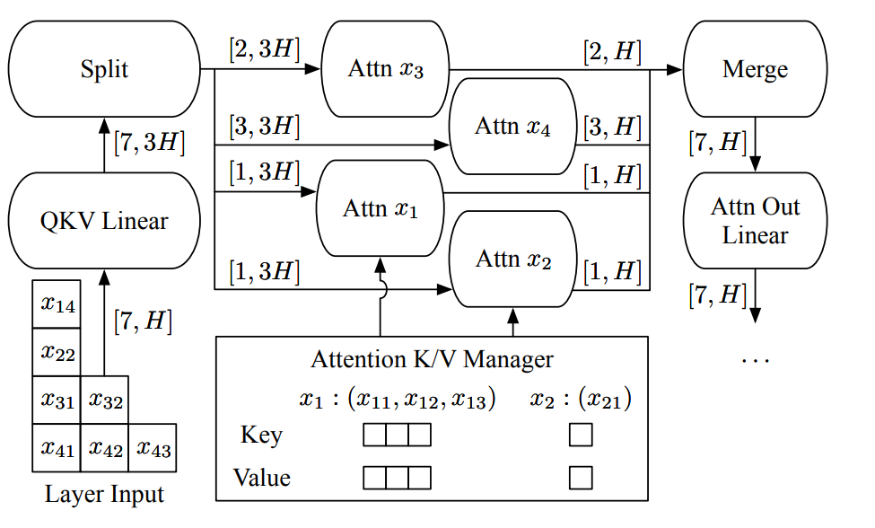

Continuous Batching
=======

Continuous batching is a more efficient batching mechanism in LLM server system when compared with static batching input and output. It has two main characteristics:
- concat input sequences in `seq_len` dimension (omit padding token) for `linear` operation and split it in `multi-head attention` and other seq-level operators (`RoPE`, etc.).
- Split sequences out immediately if they finish generation and send new sequences into inference engine.
For more technical details, please refer to [ORCA paper](https://www.usenix.org/system/files/osdi22-yu.pdf).

There is a illustration below of continuous batching from ORCA paper. $x_{ij}$ means it is a j-th token which belong to i-th request (sequence). And this figure only depicts the QKV Linear, Attention, and
Attention Out Linear operations for simplicity.



## Offline
We only support multi-batch inference in concatenating & splitting input sequences way. Because it can avoid padding mask effect for some operators (`RoPE`, etc.) and save `linear` inference time. You can use `transformers` liked code (padding prompts->giving `Torch.Tensor`->generation) to try it. We will remove those padding tokens inside and return the whole generation results with a python list. So all you need to do additionally is provide the right `pad_token_id`.

The code example is like:
```python
from transformers import AutoTokenizer, AutoModelForCausalLM
from neural_speed import Model

model_name = "meta-llama/Llama-2-7b-hf"
prompts = [
            "Tell me an interesting fact about llamas.",
            "What is the best way to cook a steak?",
            "Are you familiar with the Special Theory of Relativity and can you explain it to me?",
            "Recommend some interesting books to read.",
            "What is the best way to learn a new language?",
            ]

tokenizer = AutoTokenizer.from_pretrained(model_name, trust_remote_code=True, padding_side="left")
# if the tokenizer has no pad_token, you can specify it.
tokenizer.pad_token = tokenizer.eos_token
pad_token_id = tokenizer.pad_token_id
inputs = tokenizer(ps, padding=True, return_tensors='pt').input_ids

model = Model()
model.init(model_name, use_quant=True, weight_dtype="int4", compute_dtype="int8")
# greedy search example, top_k_top_p sampling and beam_search also supported
# do not forget to pass pad_token_id
outputs = model.generate(inputs, max_new_tokens=128, do_sample=False, pad_token=pad_token_id)
ans = tokenizer.batch_decode(outputs, skip_special_tokens=True, clean_up_tokenization_spaces=False)
for a in ans:
    print(a)
    print("===========================")
```
> Note: Not every model supports multi-batching inference and most of them are under construction, please refer to [Supported Models](#supported-models).

## Server
We supply a corresponding [script](../scripts/python_api_example_for_model_server.py) for server usage.
You can modify the `max_request_num` for setting the maximum bearable requests.

>Note: 1.The server system we developed is just a prototype now. It may change interface and usage later. 2. Not every model supports server mode and most of them are under construction, please refer to [Supported Models](#supported-models).

## Supported Models
You can refer to [developer_document](../developer_document.md#22-inference-process) for adding continuous batching inference feature in your own customized model.
<table>
  <thead>
    <tr>
      <th>Models</th>
      <th align="center">Continuous Batching Support</th>
    </tr>
  </thead>
  <tbody>
    <tr>
      <td>

[LLaMA-7B](https://huggingface.co/decapoda-research/llama-7b-hf), [LLaMA-13B](https://huggingface.co/decapoda-research/llama-13b-hf), [LLaMA2-7B](https://huggingface.co/meta-llama/Llama-2-7b-chat-hf), [LLaMA2-13B](https://huggingface.co/meta-llama/Llama-2-13b-chat-hf), [LLaMA2-70B](https://huggingface.co/meta-llama/Llama-2-70b-chat-hf)</td>
      <td align="center">✅</td>
    </tr>
    <tr>
      <td>
[CodeLlama-7b](https://huggingface.co/codellama/CodeLlama-7b-Instruct-hf)</td>
      <td align="center">✅</td>
    </tr>
    <tr>
      <td>
[Solar-10.7B](https://huggingface.co/upstage/SOLAR-10.7B-Instruct-v1.0)</td>
      <td align="center">✅</td>
    </tr>
    <tr>
      <td>
[Neural-Chat-7B-v3-1](https://huggingface.co/Intel/neural-chat-7b-v3-1), [Neural-Chat-7B-v3-2](https://huggingface.co/Intel/neural-chat-7b-v3-2)</td>
      <td align="center">✅</td>
    </tr>
    <tr>
      <td>
[Magicoder-6.7B](https://huggingface.co/ise-uiuc/Magicoder-S-DS-6.7B)</td>
      <td align="center">✅</td>
    </tr>
    <tr>
      <td>
[Mistral-7B](https://huggingface.co/mistralai/Mistral-7B-v0.1), [Mixtral-8x7B](https://huggingface.co/mistralai/Mixtral-8x7B-Instruct-v0.1)</td>
      <td align="center">✅</td>
    </tr>
    <tr>
      <td>
[GPT-J-6B](https://huggingface.co/EleutherAI/gpt-j-6b)</td>
      <td align="center">✅</td>
    </tr>
    <tr>
      <td>
[GPT-NeoX-20B](https://huggingface.co/EleutherAI/gpt-neox-20b), [Dolly-v2-3B](https://huggingface.co/databricks/dolly-v2-3b)</td>
      <td align="center">🚧</td>
    </tr>
    <tr>
      <td>
[Qwen-7B](https://huggingface.co/Qwen/Qwen-7B-Chat), [Qwen-14B](https://huggingface.co/Qwen/Qwen-14B-Chat), [Qwen1.5-7B](https://huggingface.co/Qwen/Qwen1.5-7B-Chat"), [Qwen1.5-0.5B](https://huggingface.co/Qwen/Qwen1.5-0.5B)</td>
      <td align="center">🚧</td>
    </tr>
    <tr>
      <td>
[MPT-7B](https://huggingface.co/mosaicml/mpt-7b), [MPT-30B](https://huggingface.co/mosaicml/mpt-30b)</td>
      <td align="center">🚧</td>
    </tr>
    <tr>
      <td>
[Falcon-7B](https://huggingface.co/tiiuae/falcon-7b), [Falcon-40B](https://huggingface.co/tiiuae/falcon-40b)</td>
      <td align="center">🚧</td>
    </tr>
    <tr>
      <td>
[BLOOM-7B](https://huggingface.co/bigscience/bloomz-7b1)</td>
      <td align="center">🚧</td>
    </tr>
    <tr>
      <td>
[OPT-125m](https://huggingface.co/facebook/opt-125m), [OPT-350m](https://huggingface.co/facebook/opt-350m), [OPT-1.3B](https://huggingface.co/facebook/opt-1.3b), [OPT-13B](https://huggingface.co/facebook/opt-13b)</td>
      <td align="center">🚧</td>
    </tr>
    <tr>
      <td>
[ChatGLM-6B](https://huggingface.co/THUDM/chatglm-6b), [ChatGLM2-6B](https://huggingface.co/THUDM/chatglm2-6b), [ChatGLM3-6B](https://huggingface.co/THUDM/chatglm3-6b)</td>
      <td align="center">🚧</td>
    </tr>
    <tr>
      <td>
[StarCoder-1B](https://huggingface.co/bigcode/starcoderbase-1b), [StarCoder-3B](https://huggingface.co/bigcode/starcoderbase-3b), [StarCoder-15.5B](https://huggingface.co/bigcode/starcoder)</td>
      <td align="center">🚧</td>
    </tr>
    <tr>
      <td>
[Baichuan-13B-Chat](https://huggingface.co/baichuan-inc/Baichuan-13B-Chat), [Baichuan2-13B-Chat](https://huggingface.co/baichuan-inc/Baichuan2-13B-Chat)</td>
      <td align="center">🚧</td>
    </tr>
    <tr>
      <td>
[phi-2](https://huggingface.co/microsoft/phi-2), [phi-1_5](https://huggingface.co/microsoft/phi-1_5), [phi-1](https://huggingface.co/microsoft/phi-1)</td>
      <td align="center">🚧</td>
    </tr>
    <tr>
      <td>
[StableLM-3B](https://huggingface.co/stabilityai/stablelm-3b-4e1t), [StableLM2-1_6B](https://huggingface.co/stabilityai/stablelm-2-1_6b), [StableLM2-Zephyr-1_6B](https://huggingface.co/stabilityai/stablelm-2-zephyr-1_6b)</td>
      <td align="center">🚧</td>
    </tr>
    <tr>
      <td>
[gemma-2b-it](https://huggingface.co/google/gemma-2b-it), [gemma-7b](https://huggingface.co/google/gemma-7b)</td>
      <td align="center">🚧</td>
    </tr>
  </tbody>
</table>

> ✅: Supported; 🚧: WIP
